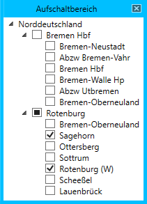

# Aufschaltbereich

Das Fenster *Aufschaltbereich* öffnet sich automatisch nach dem Start eines neuen Spiels. Es kann außerdem manuell über den Menüpunkt *Fenster > Aufschaltbereich* geöffnet werden. Es dient dazu, dem LeiBIT mitzuteilen, welchen Stellbereich man selbst bedient und für welche Bahnhöfe man sich besonders interessiert.

In dem Fenster werden alle geladenen Stellwerke mit ihren Betriebsstellen dargestellt. In dem Bild oben sind die Stellwerke *Bremen Hbf* und *Rotenburg* geladen. Die Betriebsstellen, die ausgewählt wurden, werden in der [Zugfahrtinformation (ZFI)](zfi.md) dargestellt und stehen für die Anzeige der [Bahnhofsfahrordnung (BFO)](bfo.md) zur Auswahl.

Außerdem ist für die [Verspätungsbegründung](verspaetung.md) relevant, welche Betriebsstellen hier gewählt werden. Sobald eine Betriebsstelle eines Stellbereiches gewählt wurde, müssen alle Verspätungen, die in diesem Stellbereich entstehen, begründet werden (falls in den [Einstellungen](einstellungen.md) aktiviert). Bei obiger Auswahl müssen also auch Verspätungen begründet werden, die etwa in Sottrum oder Lauenbrück entstehen, allerdings nicht jene aus Bremen Hbf.

Wenn Betriebsstellen in Spiegelfeldern dargestellt sind, kann es vorkommen, dass sie zwei Mal in der Liste auftauchen. Das ist bspw. für den Bahnhof *Bremen-Oberneuland* der Fall, der zwar zum Stellbereich von Rotenburg gehört, aber auch in den Spiegelfeldern von Bremen Hbf dargestellt wird.

Als Faustregel gilt, dass nur Betriebsstellen ausgewählt werden sollten, die man auch selbst bedient. Sonst muss man Verspätungen begründen, für die man nicht verantwortlich ist, und das ZFI wird unübersichtlich. Bedient man selbst das Stellwerk Rotenburg, bietet es sich bspw. an, die Bahnhöfe *Rotenburg (W)* und *Sagehorn* zu wählen, da dies die betrieblichen Mittelpunkte der Simulation sind.