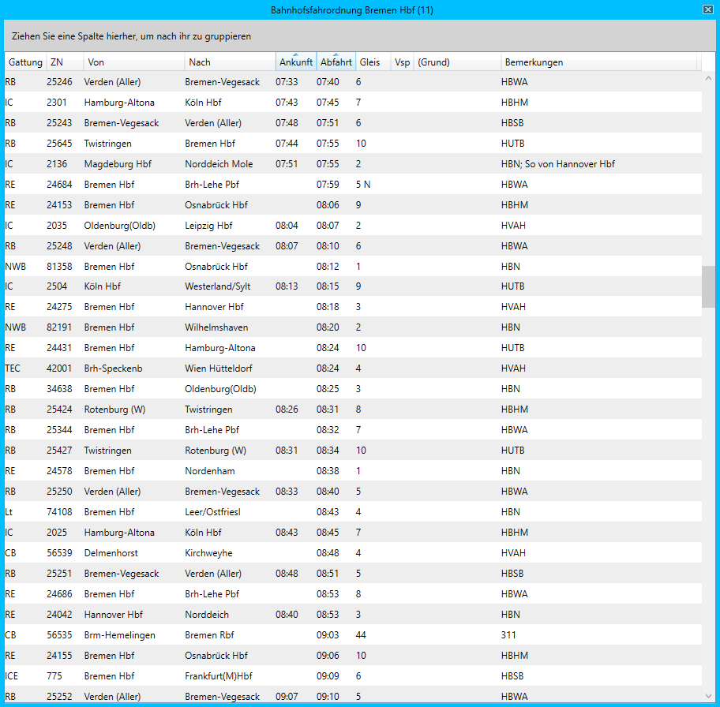

# Bahnhofsfahrordnung (BFO)

Das Fenster *Bahnhofsfahrordnung* kann über den Menüpunkt *Fenster > Bahnhofsfahrordnung (BFO)* oder durch Klick auf den Button  geöffnet werden. Es ist jeweils eine Betriebsstelle auszuwählen, für die die BFO angezeigt werden soll.

Die BFO ist eine tabellarische Darstellung der Fahrpläne aller Züge in einer Betriebsstelle. Es werden alle Züge angezeigt, deren Ankunfts- oder Abfahrtszeit innerhalb der nächsten zwölf Stunden liegt. Sobald ein Zug den Bahnhof verlassen hat, wird er nicht mehr angezeigt. Folgende Informationen werden angezeigt:

- **Gattung:** Zuggattung, z.B. RB (Regionalbahn) oder IC (Intercity)
- **ZN:** Zugnummer
- **Von:** Startbahnhof des Zuges
- **Nach:** Endbahnhof des Zuges
- **Ankunft:** Planmäßige Ankunftszeit des Zuges (leer bei beginnenden und durchfahrenden Zügen)
- **Abfahrt:** Planmäßige Abfahrtszeit des Zuges (leer bei endenden Zügen)
- **Gleis:** Planmäßige Gleisnummer. Fährt der Zug abweichend vom Fahrplan auf einem anderen Gleis, so wird das abweichende (tätsachliche) Gleis angezeigt und das planmäßige Gleis in Klammern gesetzt. Würde ein Zug also planmäßig auf Gleis 3 halten, hält aber tatsächlich außerplanmäßig auf Gleis 1, wird "1 (3)" angezeigt.
- **Vsp:** Aktuelle Verspätung des Zuges. Dies ist nicht zu verwechseln mit der erwarteten Ankunfts- oder Abfahrtszeit. Letztere werden in der BFO nicht angezeigt.
- **(Grund):** Falls für die Verspätung eine Begründung vorliegt, wird diese hier angezeigt.
- **Bemerkungen:** Bemerkungen zu dem Zug für die jeweilige Betriebsstelle, z.B. in welche Richtung er fahren soll

Durch Doppelklick auf eine Zeile kann das [Zuglauf](zuglauf.md) Fenster geöffnet werden.