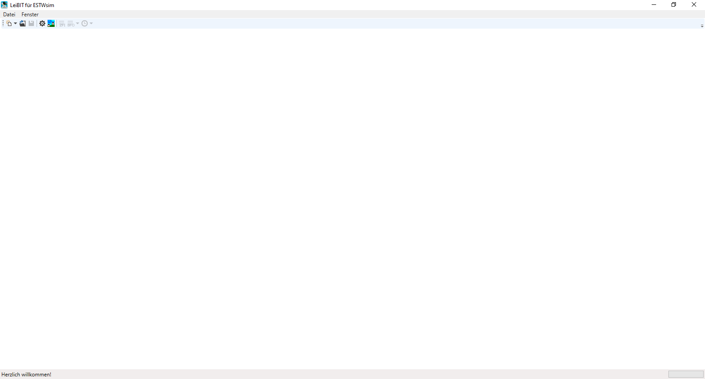
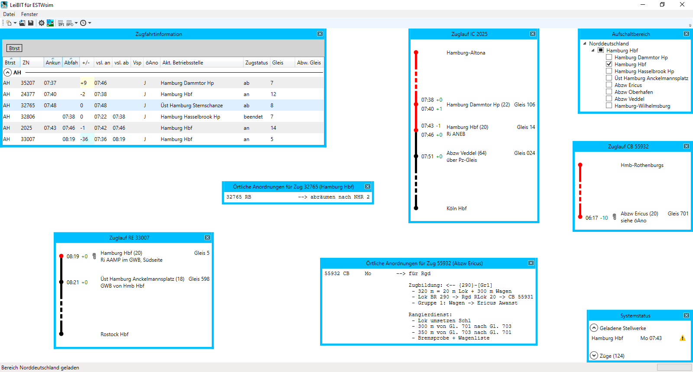

# LeiBIT für ESTWsim
Die Simulationssoftware *ESTWsim* ist ein von Thomas Bauer entwickeltes Programm, das elektronische Stellwerke (ESTW) sehr realitätsnah simuliert ([ESTWsim Homepage](https://www.estwsim.de)). Bei dem hier beschriebenen LeiBIT handelt es sich um ein Zusatzprogramm, das Zuglaufdaten, örtliche Anweisungen und andere betriebliche Informationen in Anlehnung an das "echte" LeiBIT/LeiDis System darstellt. Zur Kommunikation mit ESTWsim dient das von Bernhard Stief entwickelte Tool *ESTWonline*.

## Programmoberfläche

Beim Start des Programms öffnet sich zunächst eine leere Oberfläche. Das gesamte Programm ist so aufgebaut, dass es verschiedene Fenster gibt, die automatisch oder vom Nutzer selbst geöffnet werden können. Jedes Fenster kann auf dem zur Verfügung stehenden Platz frei verschoben und ggf. vergrößert oder verkleinert werden, sodass die Anordnung der Fenster völlig dynamisch ist. Neue Fenster werden nach Möglichkeit immer so platziert, dass sie sich nicht mit anderen Fenstern überlappen. 

Im laufenden Betrieb kann das dann bspw. so aussehen:

Folgende Fenster stehen aktuell zur Verfügung. Für eine Detailbeschreibung bitte auf das jeweilige Fenster klicken.
- [Zugfahrtinformation (ZFI)](zfi.md)
- [Bahnhofsfahrordnung (BFO)](bfo.md)
- [Zuglauf](zuglauf.md)
- [Örtliche Anordnungen](oeano.md)
- [Verspätungsbegründung](verspaetung.md)
- [Aufschaltbereich](aufschaltbereich.md)
- [Systemstatus](systemstatus.md)
- [Einstellungen](einstellungen.md)

## Neues Spiel beginnen
Über den Menüpunkt *Datei > Neu* kann ein neuer Spielstand erzeugt werden. Alternativ kann auch der Button  betätigt werden. Beim Starten eines neuen Spiels muss immer der jeweilige Bereich angegeben werden. Simuliert man bspw. gerade eine Schicht in Bremen Hbf, sollte der Bereich *Norddeutschland* ausgewählt werden. Nach dem Start eines neuen Spiels wird das Fenster [Aufschaltbereich](aufschaltbereich.md) geöffnet.

## Spielstände speichern
Um ein begonnenes Spiel zu speichern, können der Menüpunkt *Datei > Speichern* oder der Button  bedient werden. Hat man zuvor einen Spielstand geladen, wird dieser überschrieben. Ist dies nicht gewünscht, kann man stattdessen den Menüpunkt *Datei > Speichern unter...* wählen und einen Speicherort für den neuen Spielstand angeben. Hat man hingegen keinen Spielstand geladen, öffnet sich ebenfalls ein Dialog zur Auswahl des Speicherortes.

## Spielstände laden
Über den Menüpunkt *Datei > Öffnen* kann ein zuvor gespeicherter Spielstand (*.leibit Datei) geöffnet werden. Alternativ kann auch der Button  betätigt werden. Nach Auswahl einer gültigen Datei wird der gespeicherte Spielstand geladen und alle Fenster werden so angeordnet, wie sie zum Zeitpunkt des Speicherns positioniert waren.

## Weitere Menüpunkte
- Mithilfe des Menüpunktes *Datei > Einstellungen* oder des Buttons  werden die [Programmeinstellungen](einstellungen.md) geöffnet.
- Durch einen Klick auf den Menüpunkt *Datei > ESTWonline starten* oder den Button  wird das Tool ESTWonline gestartet, das zur Kommunikation mit ESTWsim dient. Voraussetzung ist, dass der ESTWonline Pfad in den [Einstellungen](einstellungen.md) konfiguriert wurde.
- Der Menüpunkt *Fenster > Aufschaltbereich* öffnet das Fenster Aufschaltbereich [Aufschaltbereich](aufschaltbereich.md), falls dieses manuell geschlossen wurde. Es muss dafür bereits ein Bereich geladen sein, d.h. es muss zuvor ein neues Spiel gestartet bzw. ein Spielstand geladen werden.
- Über den Menüpunkt *Fenster > Zugfahrtinformation (ZFI)* oder den Button  wird das Fenster [Zugfahrtinformation (ZFI)](zfi.md) geöffnet. Auch hier muss bereits ein Bereich geladen sein.
- Die [Bahnhofsfahrordnung (BFO)](bfo.md) lässt sich über den Menüpunkt *Fenster > Bahnhofsfahrordnung (BFO)* oder den Button  öffnen. Dabei muss ausgewählt werden, für welchen Bahnhof die BFO geöffnet werden soll. Es stehen alle Bahnhöfe zur Auswahl, die im Fenster [Aufschaltbereich](aufschaltbereich.md) gewählt wurden.
- Um sich den Zuglauf eines Zuges ansehen zu können, kann der Button  betätigt werden. Anschließend kann die Zugnummer eingegeben werden, für die man sich den Zuglauf ansehen möchte.
- Über den Menüpunkt *Fenster > Systemstatus* wird das Fenster [Systemstatus](systemstatus.md) geöffnet.
- Der Menüpunkt *Fenster > Layout speichern* speichert die Layoutinformationen aller geöffneten Fenster. Dazu gehören Spaltenbreiten, die Reihenfolge und Sortierung von Spalten sowie ggf. Gruppierungen. Gegenwärtig betrifft dies die Fenster [Zugfahrtinformation (ZFI)](zfi.md), [Bahnhofsfahrordnung (BFO)](bfo.md) sowie [Systemstatus](systemstatus.md). Werden diese Fenster geschlossen und erneut geöffnet, sieht das Layout genauso aus wie vorher. Weitere Details [hier](tabellen.md).
- Der Menüpunkt *Fenster > Alle Fenster schließen* schließt alle geöffneten Fenster, sodass man wieder eine leere Oberfläche hat.