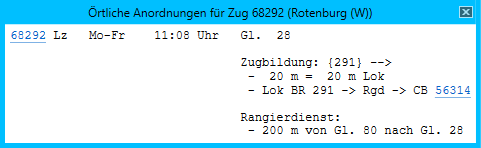

# Örtliche Anordnungen

Das Fenster *örtliche Anordnungen* kann nur aus anderen Fenstern heraus aufgerufen werden, z.B. aus der [Zugfahrtinformation](zfi.md) oder dem [Zuglauf](zuglauf.md).

Es werden die örtlichen Anordnungen für einen Zug in einem Bahnhof angezeigt. Zugnummern (ab vier Ziffern) werden als Link dargestellt. Beim Klick darauf öffnet sich das Fenster [Zuglauf](zuglauf.md) für den jeweiligen Zug.