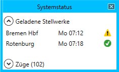
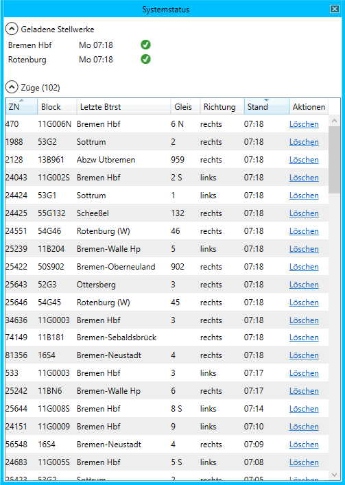

# Systemstatus

Das Fenster *Systemstatus* kann über den Menüpunkt *Fenster > Systemstatus* geöffnet werden.

## Geladene Stellwerke
Im Bereich *Geladene Stellwerke* werden alle Stellwerke angezeigt, deren Züge, Fahrplandaten etc. geladen wurden. Außerdem wird die Zeit angezeigt, die das Stellwerk gerade hat. Rechts daneben kann man sehen, ob das Stellwerk aktiv oder inaktiv ist. Werden regelmäßig Daten vom Stellwerk per ESTWonline empfangen, ist das Stellwerk aktiv und ein grüner Haken wird angezeigt. Werden über einen längeren Zeitraum (in den [Einstellungen](einstellungen.md) konfigurierbar) keine Daten von einem Stellwerk empfangen, wird es als inaktiv gekennzeichnet und ein gelbes Warndreieck wird angezeigt.

## Züge
Der Bereich *Züge* ist nach dem Öffnen des Fensters zunächst zugeklappt und stellt alle Züge dar, die gerade in der Simulation vorhanden sind oder den Stellbereich in der letzten Zeit durchfahren haben. Wird dieser Bereich aufgeklappt, vergrößert sich das Fenster und eine tabellarische Übersicht der Züge wird sichtbar.

- **ZN:** Zugnummer
- **Block:** Blocknummer des letzten Blocks, der dem Zug zugeordnet wurde
- **Letzte Btrst:** Die zu dem Block gehörige Betriebsstelle
- **Gleis:** Das zu dem Block gehörige Gleis
- **Richtung:** Fahrtrichtung, in die der Zug zuletzt fuhr
- **Stand:** Zeit, zu der der Zug zuletzt "gesehen" wurde
- **Aktionen:** Um die aktuellen Zuglaufdaten zu löschen, kann auf *Löschen* geklickt werden. Es werden alle Ist-Zeiten und Verspätungsinformationen zu dem jeweiligen Zug gelöscht. Dies geschieht nach 12 (Simulations-) Stunden automatisch, damit der Zug am nächsten Tag wieder einen neuen Zuglauf bekommt.

Das Layout der Tabelle lässt sich konfigurieren (siehe [Anpassen des Tabellenlayouts](tabellen.md)). Eine Gruppierung ist hier jedoch nicht möglich. Durch Doppelklick auf eine Zeile kann das [Zuglauf](zuglauf.md) Fenster geöffnet werden.