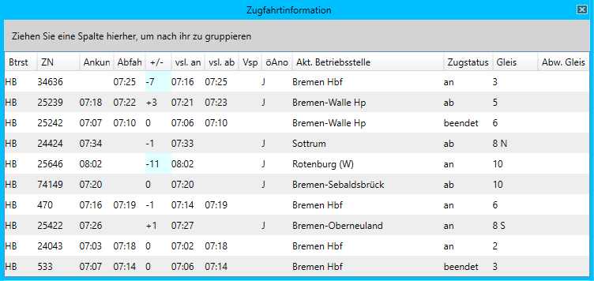
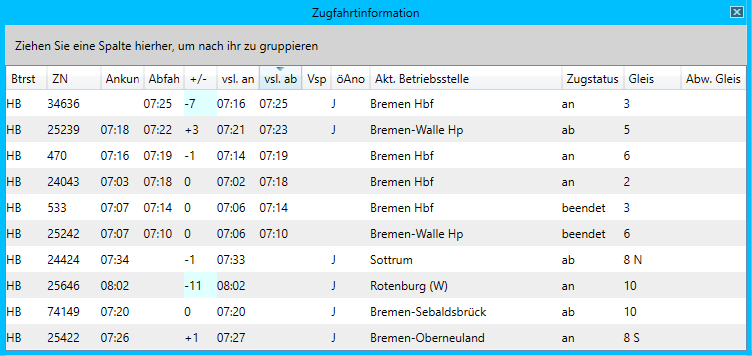
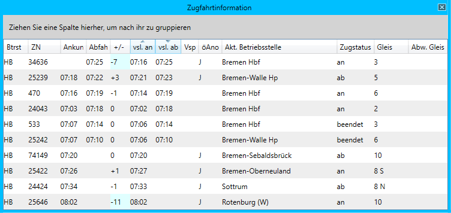
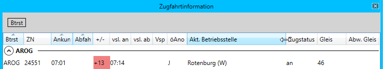
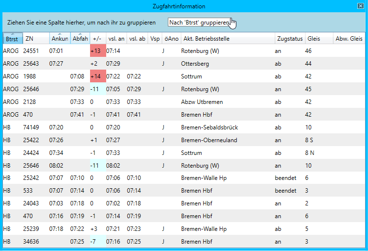
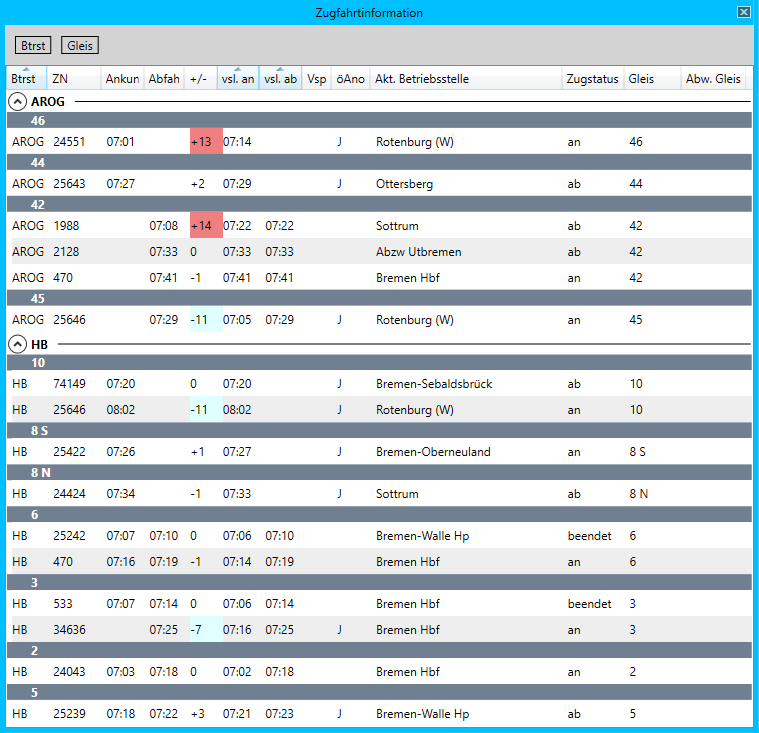
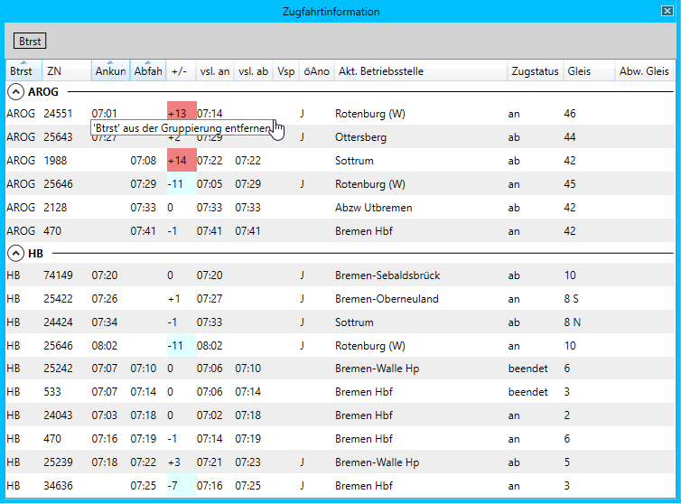

# Anpassen des Tabellenlayouts

Die Layouts aller Tabellen können angepasst und frei konfiguriert werden. Im Folgenden wird erklärt, welche Anpassungen möglich sind. Solch konfigurierbare Tabellen finden sich aktuell in den Fenstern [Zugfahrtinformation](zfi.md), [Bahnhofsfahrordnung](bfo.md) und [Systemstatus](systemstatus.md).

## Änderung der Spaltenreihenfolge
Die Reihenfolge der Spalten kann per "Drag&Drop" geändert werden.

1. Die Überschrift der Spalte, die verschoben werden soll, mit der linken Maustaste anklicken und gedrückt halten.
2. Die Spalte an die gewünschte Position ziehen. Während des Ziehens wird durch einen Pfeil die Zielposition angezeigt.
3. Linke Maustaste loslassen. Die Spalte wird nun an die gewählte Position verschoben.

In diesem Beispiel soll die Spalte *Gleis* zwischen die beiden Spalten *vsl. ab* und *Vsp* verschoben werden:

## Sortierung
Um nach einer Spalte zu sortieren, genügt ein Klick auf die Überschrift der Spalte. Nach dem ersten Klick wird aufsteigend sortiert, nach einem weiteren Klick absteigend und nach dem dritten Klick ist die Sortierung entfernt. Um nach mehreren Spalten zu sortieren, ist die *Shift* Taste gedrückt zu halten.

In dieser Darstellung ist nach keiner Spalte sortiert worden:

Nach einem Klick auf die Spaltenüberschrift *vsl. ab* ist nun nach dieser Spalte aufsteigend sortiert worden. Dies wird durch einen nach oben zeigenden Pfeil dargestellt:

Ein weiterer Klick auf die Spaltenüberschrift *vsl. ab* hat nun dafür gesorgt, dass absteigend sortiert wurde. Der Pfeil zeigt nun nach unten:

Nun wird die *Shift* Taste gedrückt und gehalten. Ein Klick auf *vsl. an* führt nun dazu, dass nach dieser Spalte zusätzlich sortiert wird:

## Anpassung der Spaltenbreite
Um die Spaltenbreite zu ändern, kann wie folgt vorgegangen werden:

1. Mit der Maus über den Bereich zwischen zwei Spalten fahren (Mauszeiger ändert Darstellung).
2. Linke Maustaste drücken und gedrückt halten.
3. Maus nach links oder rechts bewegen.
4. Wenn die Spalte die gewünschte Breite erreicht hat, linke Maustaste loslassen.

In diesem Beispiel wird die Breite der Spalte *Akt. Betriebsstelle* verändert:

## Gruppierung
Die Zeilen der Tabellen können nach einer oder mehreren Spalten gruppiert werden. Auch dies funktioniert per "Drag&Drop":

1. Die Überschrift der Spalte, nach der gruppiert werden soll, mit der linken Maustaste drücken und gedrückt halten.
2. Die Spalte in den grau hinterlegten Bereich über der Tabelle ziehen. Es wird "Nach (Spaltenname) gruppieren" angezeigt.
3. Die linke Maustaste loslassen. Die Daten werden nun nach der gewählten Spalte gruppiert.

Im folgenden Beispiel wird nach der Spalte *Btrst* gruppiert.

Die Daten wurden nun nach *Btrst* gruppiert. Die Gruppen auf oberster Ebene lassen sich auf- oder zuklappen. Eine evtl. vorhandene Sortierung wird durch die Gruppierung nicht beeinflusst.

Um nach einer weiteren Spalte zu gruppieren, können die oben beschriebenen Schritte wiederholt werden. In diesem Beispiel wurde zuerst nach *Btrst* und dann nach *Gleis* gruppiert:

Um eine Gruppierung zu entfernen, kann wie folgt vorgegangen werden:

1.  Die Spaltenüberschrift aus dem Gruppierungsbereich oberhalb der Tabelle mit der linken Maustaste anklicken und gedrückt halten.
2. Die Spalte aus dem Gruppierungsbereich heraus ziehen. Es wird "(Spaltenname) aus der Gruppierung entfernen" angezeigt.
3. Die linke Maustaste loslassen.

In diesem Beispiel wird die Spalte *Btrst* aus der Gruppierung entfernt:

## Speichern des Layouts
Um alle Änderungen am Layout zu speichern, kann der Menüeintrag *Fenster > Layout speichern* benutzt werden. Nach dem erneuten Öffnen des Fensters werden alle Tabellen wieder so dargestellt, wie es zuvor konfiguriert wurde.

