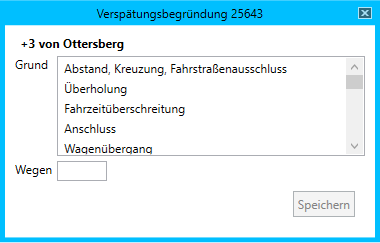

# Verspätungsbegründung

Das Fenster *Verspätungsbegründung* kann nur aus anderen Fenstern heraus aufgerufen werden, z.B. aus der [Zugfahrtinformation](zfi.md) oder dem [Zuglauf](zuglauf.md).

Die Verspätungsbegründung kann in den [Einstellungen](einstellungen.md) aktiviert oder deaktiviert werden. Bei aktiver Verspätungsbegründung müssen alle Verspätungen ab der eingestellten Minutenzahl (Standard: 3 Minuten) begründet werden.

## Wie entstehen Verspätungen?
Verspätungen müssen begründet werden, wenn ein Zug mit einer größeren Verspätung in einem Bahnhof ankommt, als er im letzten abgefahren ist, oder er einen Bahnhof mit einer größeren Verspätung verlässt, als er dort angekommen ist. Hierzu ein Beispiel:

- Bahnhof A
    - an soll 19:02, ist 19:01 (-1)
    - ab soll 19:03, ist 19:04 (+1)
- Bahnhof B
    - an soll 19:09, ist 19:14 (+5)
    - ab soll 19:09, ist 19:14 (+5)
- Bahnhof C
    - an soll 19:15, ist 19:18 (+3)
    - ab soll 19:16, ist 19:22 (+6)

In diesem Beispiel wird angenommen, dass Verspätungen ab 3 Minuten begründet werden müssen. Es müssen also nun zwei Verspätungen begründet werden.

- Im Bahnhof A ist nur eine Verspätungsminute entstanden. Dies liegt unterhalb von 3 Minuten und muss daher nicht begründet werden.
- Der Zug ist im Bahnhof B mit 5 Minuten Verspätung angekommen, aber im Bahnhof A mit nur einer Minute Verspätung abgefahren. Der özF des Bahnhof B muss nun 4 Minuten Verspätung begründen.
- In Bahnhof C ist der Zug mit 3 Minuten Verspätung angekommen und 6 Minuten zu spät abgefahren. Daraus ergeben sich 3 Minuten Verspätung, die durch den özF des Bahnhof C zu begründen sind.

## Wie werden Verspätungen begründet?
Das Fenster *Verspätungsbegründung* zeigt alle entstandenen begründungspflichtigen Verspätungen eines Zuges an, die im eigenen Stellbereich (gemäß [Aufschaltbereich](aufschaltbereich.md)) entstanden sind. Jede Verspätung muss einzeln begründet werden. Dazu steht eine Liste von möglichen Gründen zur Verfügung, von denen einer ausgewählt werden muss. Ist ein anderer Zug für die Verspätung verantwortlich (z.B. bei einer Überholung), kann die Zugnummer dieses Zuges im Feld *Wegen* eingetragen werden. Durch Klick auf *Speichern* wird der Verspätungsgrund gespeichert.

## Plausibilitätsprüfung
Die Plausibilitätsprüfung kann in den [Einstellungen](einstellungen.md) aktiviert oder deaktiviert werden. Bei aktiver Plausibilitätsprüfung wird geprüft, ob der als ursächlich angegebene Zug auch tatsächlich als Verursacher infrage kommt. Damit sollen u.a. Tippfehler (etwa Zahlendreher bei der Zugnummer) verhindert werden. Folgende Dinge werden geprüft:

- Gibt es die angegebene Zugnummer überhaupt?
- Hat der Zug die Betriebsstelle, in der die Verspätung entstanden ist, überhaupt durchfahren?
- Hat der Zug die jeweilige Betriebsstelle zu der gleichen Zeit durchfahren, zu der die Verspätung entstanden ist? Die Toleranz liegt hier bei 15 Minuten. Für die im Bahnhof B entstandene Verspätung in o.g. Beispiel bedeutet dies, dass alle Züge, die den Bahnhof B zwischen 18:59 und 19:29 passiert haben, als Verursacher infrage kommen. Ein Zug, der den Bahnhof B bereits um 18:55 Uhr durchfahren hat, würde von der Plausibilitätsprüfung als Verursacher für die Verspätung abgelehnt werden. Ein anderer Zug, der den Bahnhof B um 19:05 Uhr durchfahren hat, würde akzeptiert.

Schlägt eine der Prüfungen fehl, wird die Verspätungsbegründung abgelehnt und nicht gespeichert.

## Übertragung des Verspätungsgrundes an verbundene ESTW
Damit in einer Online-Session auch die benachbarten Fdl den Verspätungsgrund in ihrem LeiBIT sehen können, besteht die Möglichkeit, diesen per *ESTWonline* an alle verbundenen Simulationen zu übertragen. Dafür muss das LeiBIT auf demselben Rechner laufen wie die Simulation selbst, da die Daten über das *ESTWonline* des Stellwerks übertragen werden. Aus diesem Grund muss diese Option in den [Einstellungen](einstellungen.md) explizit aktiviert werden.