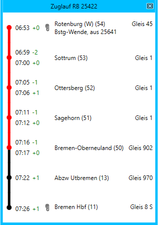
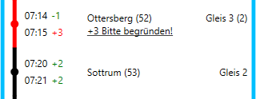
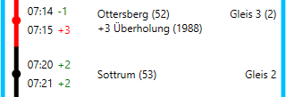
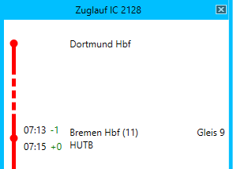

# Zuglauf

Das Fenster *Zuglauf* kann durch Klick auf den Button  oder aus verschiedenen anderen Fenstern heraus geöffnet werden.

Es werden alle Betriebsstellen gemäß Fahrplan dargestellt. In den [Einstellungen](einstellungen.md) kann festgelegt werden, ob alle bekannten Betriebsstellen angezeigt werden sollen oder nur diejenigen des eigenen Stellbereichs (gemäß Auswahl im Fenster [Aufschaltbereich](aufschaltbereich.md)). Für jede Betriebsstelle werden folgende Informationen dargestellt:

- Die planmäßigen Ankunfts- und Abfahrtzeiten des Zuges
- Die erwartete Verspätung
- Der Name der Betriebsstelle sowie die Bereichskennzahl
- Ggf. vorhandene Bemerkungen im Fahrplan
- Das planmäßige und (wenn abweichend) tatsächliche Gleis

Sind in einem Bahnhof örtliche Anordnungen für den Zug vorhanden, wird das Symbol  angezeigt. Durch Klick auf dieses Symbol öffnet sich das Fenster [örtliche Anordnungen](oeano.md).

Die Linie auf der linken Seite symbolisiert den Fahrtverlauf des Zuges. Die rot markierte Strecke wurde bereits zurückgelegt, während die schwarz dargestellte Strecke noch vor dem Zug liegt. Die Darstellung in obigem Bild zeigt, dass der Zug sich gerade im Bahnhof *Bremen-Oberneuland* befindet, diesen aber noch nicht verlassen hat.

In folgendem Bild hat der Zug den Bahnhof *Ottersberg* verlassen und befindet sich nun zwischen *Ottersberg* und *Sottrum*. Außerdem ist der Zug abweichend vom Fahrplan auf Gleis 3 gefahren.

Im Bahnhof *Ottersberg* ist eine Verspätung von 3 Minuten entstanden, die begründet werden muss. Durch Klick auf den Link öffnet sich das Fenster [Verspätungsbegründung](verspaetung.md). Ist die Verspätung begründet worden, wird der Grund angezeigt:

Verspätungen ab 3 Minuten werden grundsätzlich rot dargestellt, bis einschließlich 2 Minuten grün.

Für Züge, die nicht im dargestellten Stellbereich beginnen, wird der Startbahnhof dargestellt, gefolgt von einer gestrichelten Linie, die die fehlenden "unbekannten" Zwischenstationen symbolisiert. Eine analoge Darstellung erfolgt für die Endbahnhöfe.

